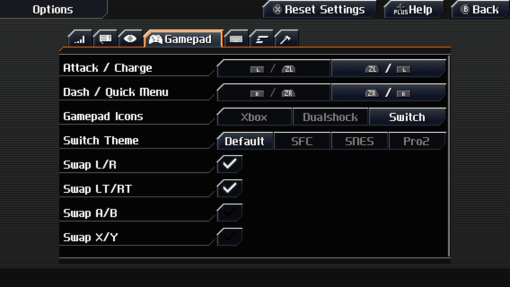
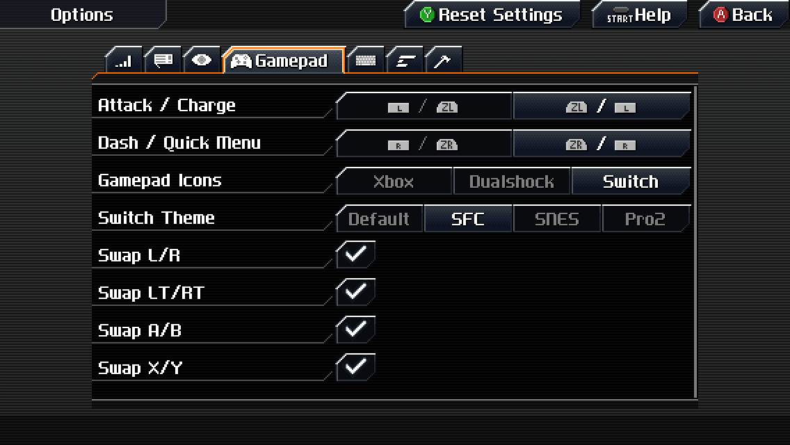
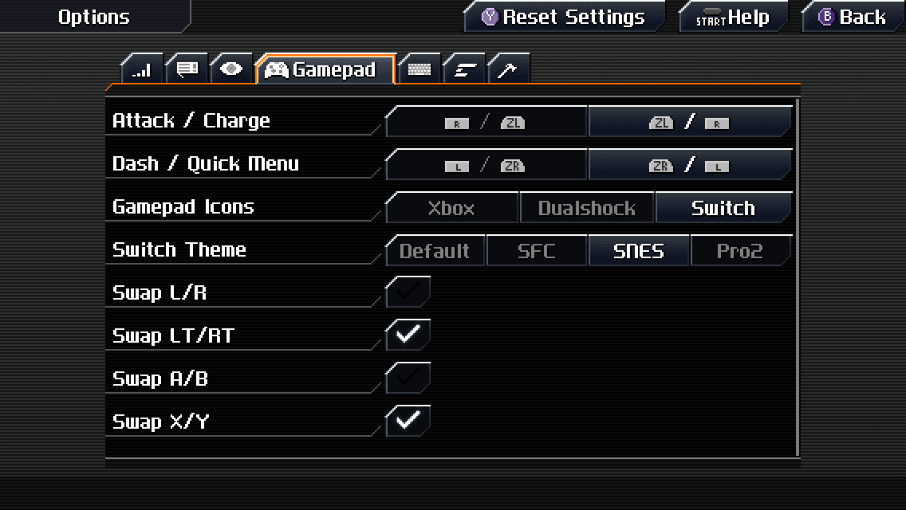
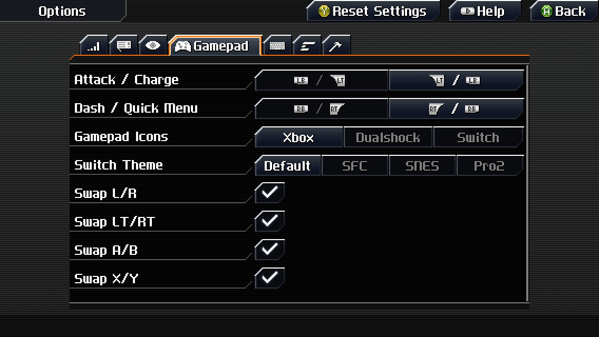
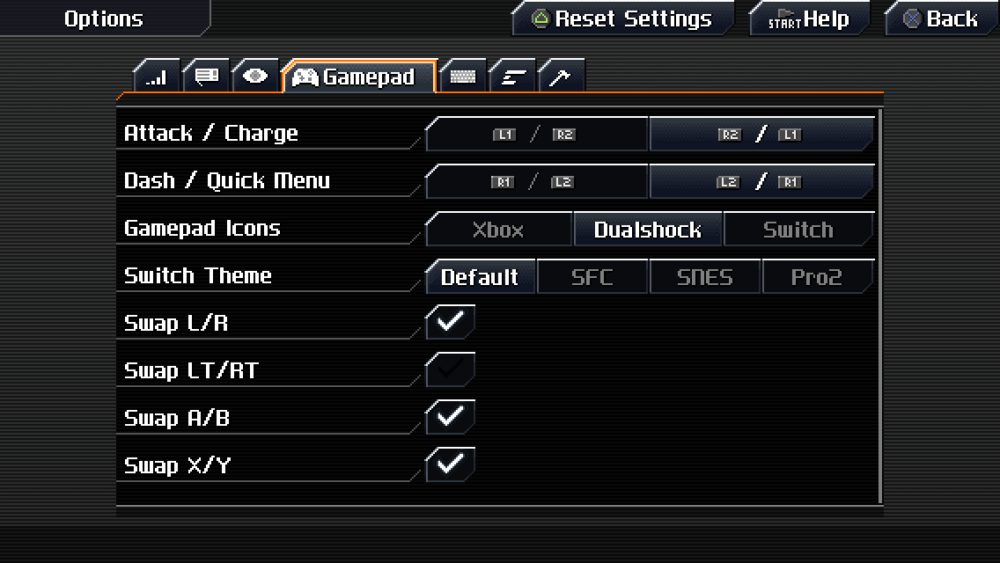

# CCExtraGamepadOptions
A mod for CrossCode that adds some additional gamepad options. For use with [CCLoader](https://github.com/CCDirectLink/CCLoader) (see: [installing mods](https://github.com/CCDirectLink/CCLoader/wiki/Install-mods))

### This mod adds the following features:
- You may now swap L and R
- You may now swap LT and RT
- You may now swap A and B
- You may now swap X and Y
- Some minor sprite alignment issues in the original sprite sheet have been corrected
- The official Nintendo Switch gamepad icon theme, as seen in the Switch port of the game, is now a selectable icon theme
  - The Plus and Minus buttons on the Default Switch theme have been replaced with more readable buttons
  - There are three additional color schemes for the Switch icon theme:
    - The SNES (Super Nintendo) and SFC (Super Famicom) color schemes were made to match the [8BitDo SN30 and SFC30](screenshots/sn30-sfc30.png)
    - The Pro2 color scheme was made to match the [8BitDo SN30 Pro 2](screenshots/sn30pro2.png)

Here are some screenshots showing the new options and themes:

